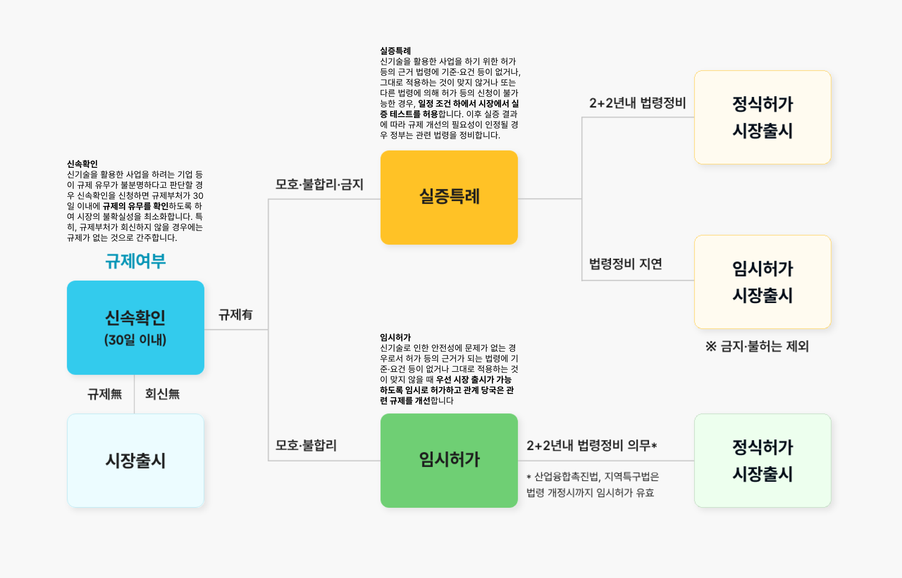
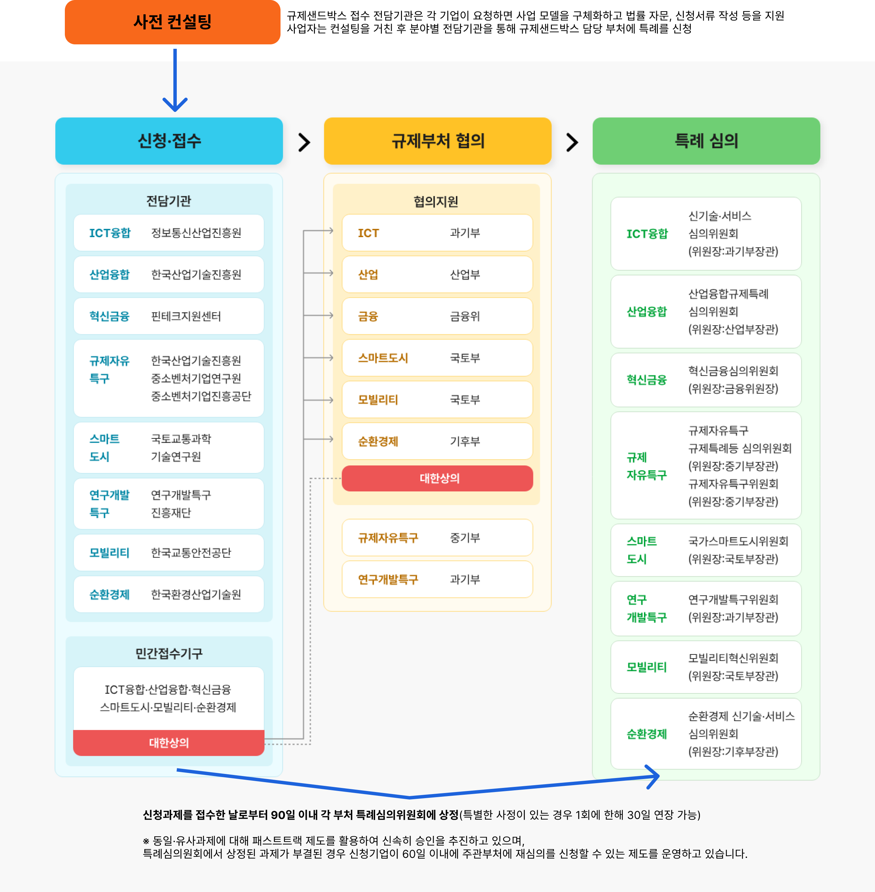
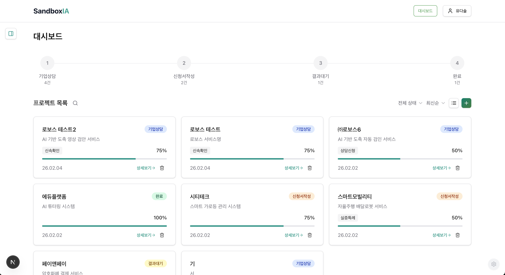
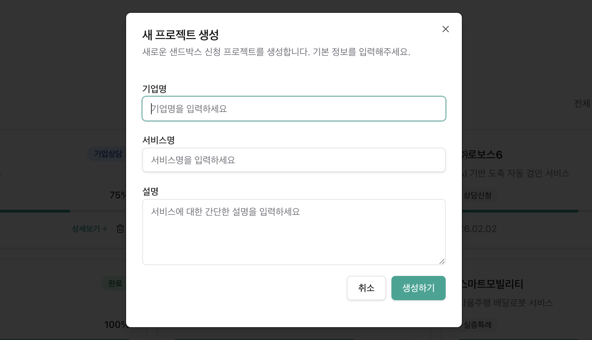
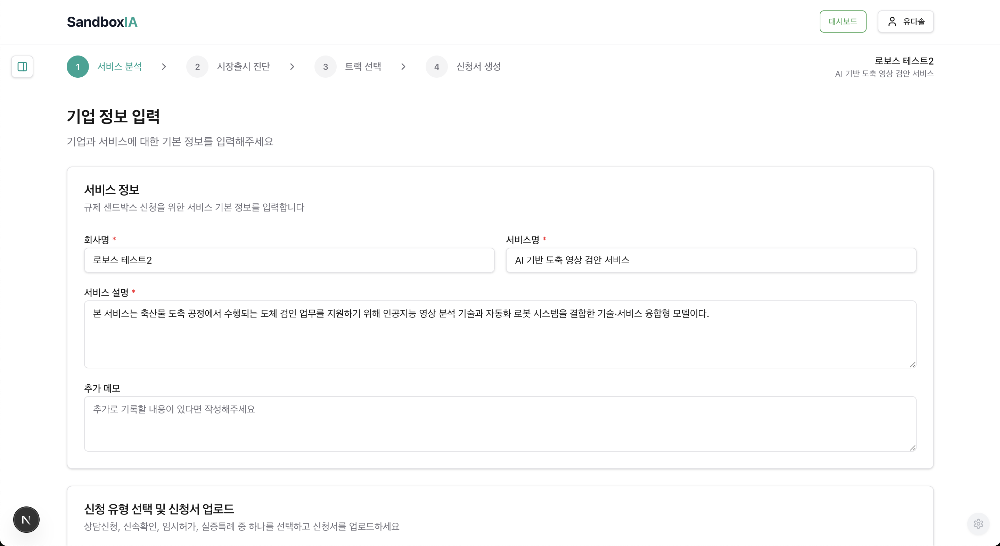
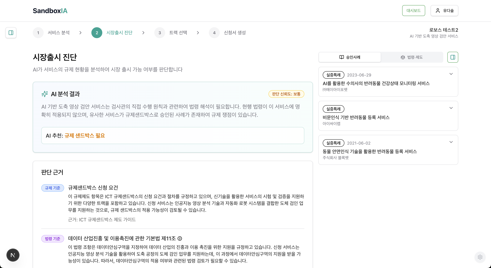
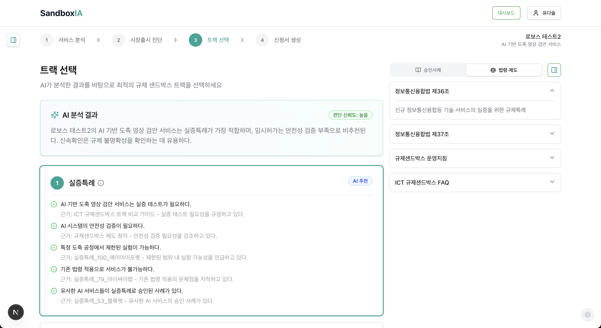
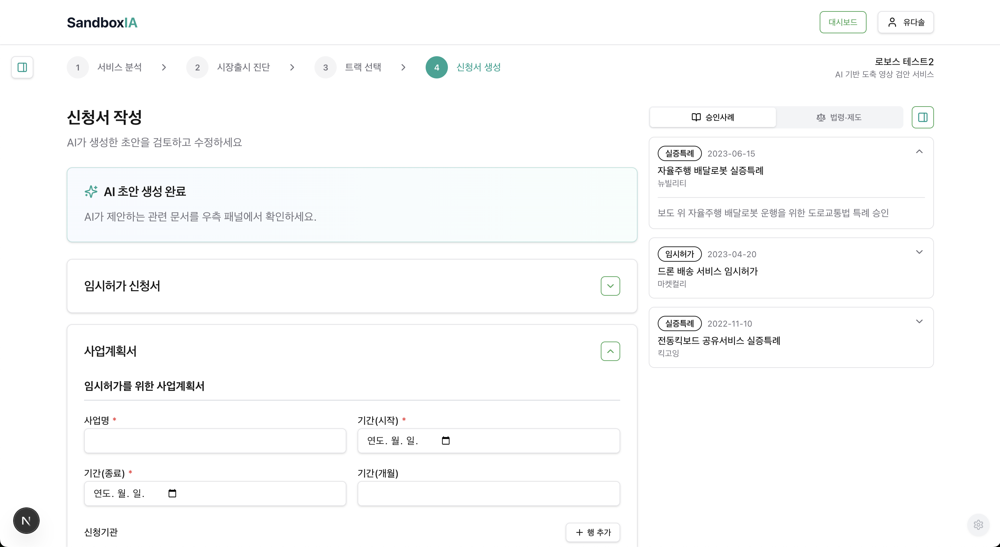
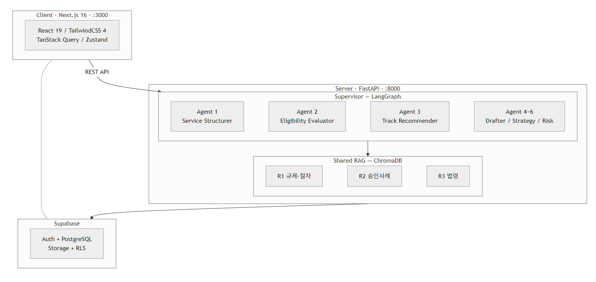
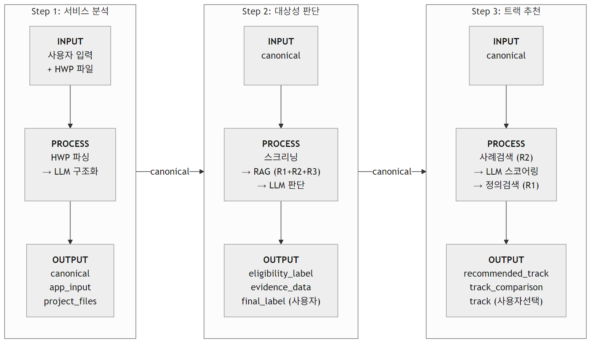

<!-- _class: title -->

# SandboxIA

## 규제 샌드박스 컨설턴트 지원 AI

**AI Camp 4기 | Team 4th Law SandboxIA**

중간 보고 발표

---

## 목차

<div style="display: grid; grid-template-columns: 1fr 1fr 1fr; gap: 8px; margin-top: 10px; font-size: 0.9em;">

<div class="accent-box">

**Why** — 타겟 / 배경 / 문제 정의

</div>
<div class="accent-box">

**What** — 서비스 정의 / 핵심 가치

</div>
<div class="accent-box">

**How** — 유저 시나리오 (Step 0~5)

</div>
<div class="accent-box">

**주요 기능** — Agent 1~4 소개

</div>
<div class="accent-box">

**아키텍처 & RAG** — 기술 스택 / ERD

</div>
<div class="accent-box">

**기획 & 개발** — 진행률 / 이슈 / 과제

</div>
<div class="accent-box">

**느낀점 & Q&A** — 데모 영상은 발표 후 진행

</div>
</div>


</div>

---

<!-- _class: divider -->

# Why

왜 이 서비스를 써야 하는가?

---

## 타겟: 규제샌드박스 신청 컨설턴트

<div style="display: grid; grid-template-columns: 1fr 1fr; gap: 20px;">

<div>

### 누구인가?

- 사업자가 규제샌드박스 3가지 트랙에 신청하기 **전**, 신청서 작성을 대행·자문하는 전문가
- **공공기관 컨설턴트** (ICT 융합 지원기관)
- **민간 행정사**

</div>

<div>

### 규제 샌드박스란?

<div class="accent-box">

신산업 제품·서비스에 대해 일정 조건 하에 **기존 규제를 면제·유예하는 제도**

</div>

**3가지 트랙:**
- **신속확인** — 규제 법적 논점 + 소관부처 특정
- **임시허가** — 면제/완화 범위 + 안전성·이용자보호방안
- **실증특례** — 위 내용 + 세부 실증계획

</div>

</div>

---

## 배경: 수요 급증 vs. 리소스 한계



### 정부의 개선 의지

- 규제 절차 간소화 + 불필요 규제 타파에 집중
- **2026년** 산업융합촉진법 개정안으로 행정 부담 완화
- 기업들의 **규제샌드박스 신청 수요 급증** 전망

### 컨설턴트의 현실

- 컨설턴트 1인당 처리 케이스 증가
- 조사·작성 시간은 줄어들지 않음
- **퀄리티 유지와 속도 양립이 어려움**

<div class="warn-box">

회신 기한 **30일 → 15일** 단축
수요는 늘고, 시간은 줄어드는 구조

</div>

---

## 문제 정의 3가지



<div style="display: grid; grid-template-columns: 1fr 1fr 1fr; gap: 14px; margin-top: 8px; font-size: 0.9em;">

<div style="background: #fef2f2; border-radius: 12px; padding: 14px;">

### 1. 신청서 작성의 복잡성

- 트랙별 양식·필수 항목이 다름
- 의뢰 기업 기술 이해
→ 관련 규제 법령 검색
→ **승인 가능 논리 구조 구성**

</div>

<div style="background: #fef2f2; border-radius: 12px; padding: 14px;">

### 2. 유사 사례 조사 비효율

- 과거 승인 사례(PDF) **수작업 검색**
- 쟁점 법령·논리 전개 **일일이 파악**
- 정보 파편화 → 누락·오류

</div>

<div style="background: #fef2f2; border-radius: 12px; padding: 14px;">

### 3. 수요 급증 vs. 리소스

- 2026년 법 개정으로 신청 수요 증가
- 조사·작성 시간은 그대로
- **품질과 속도를 동시에** 달성 불가

</div>

</div>

---

<!-- _class: divider -->

# What

무엇으로 구성되고, 핵심 가치는 무엇인가?

---

## 서비스 정의 & 핵심 가치

> 규제샌드박스 3개 트랙(신속확인·임시허가·실증특례) 신청서 작성을 지원하는 **컨설턴트 전용 AI 워크플레이스**

<div style="display: grid; grid-template-columns: 1fr 1fr; gap: 10px; margin-top: 6px;">

<div class="accent-box">

**유사 사례 즉시 매칭** — 의뢰 기업 키워드 입력 → 승인 사례 DB에서 유사 케이스 자동 추출

</div>
<div class="accent-box">

**법령·논점 자동 연결** — 쟁점 규제 법령, 소관부처, 논리 구조를 한눈에 제공

</div>
<div class="accent-box">

**트랙별 신청서 초안 생성** — 신속확인 / 임시허가 / 실증특례 양식에 맞춰 초안 자동 구성

</div>
<div class="accent-box">

**근거 기반 작성** — 유사 승인 사례를 인용·참조하여 설득력 있는 논리 전개 지원

</div>

</div>

---

<!-- _class: divider -->

# How

어떻게 사용하는가? (유저 시나리오)

---

## Step 0~1: Intro & Case 생성




<br>

### Step 0. 서비스 진입

**컨설턴트 상태:** 고객사 미팅 직후, 비정형 신청서·노트 보유, 샌드박스 대상 여부 정리 필요
**UI:** 기존 Case 대시보드 / 새 Case 생성

<br>

### Step 1. Case 생성 & 기본 정보

**입력:** Case 이름 / 고객사명 / 산업군(선택) / 메모(선택)
**의미:** 이후 모든 분석 결과가 이 Case에 귀속

---

## Step 2~3: 서비스 구조화 & 대상성 판단




<br>

### Step 2. 서비스 설명 구조화

**입력:** 신청서 업로드(HWP) + 미팅 노트
**AI 출력:** 서비스 요약 / 핵심 기능 분해 / 잠재 규제 쟁점 후보
**UI:** 각 항목 컨설턴트 수정 가능

<br>

### Step 3. 대상성 1차 판단

**AI 출력:** ✔️ 필요성 높음 / ⚠️ 병행 검토 / ❌ 가능성 낮음 + 판단 근거
**분기:** ✔️/⚠️ → 트랙 추천 | ❌ → Case "보류" 저장
**UI:** "법적 결론 아님" 명확 표시

---

## Step 4~5: 트랙 추천 & 신청서 초안




<br>

### Step 4. 트랙 추천

**AI 출력:** 추천 트랙 1~2개 + 추천 사유, 서비스 특성 × 트랙 요건 매칭
**UI:** 트랙 선택 확정 + 유사 승인 사례 참조 패널

<br>

### Step 5. 신청서 초안 생성

**AI 출력:** 서비스 개요 / 기술 설명 / 실증 필요성 / 기대 효과
**UI:** 초안 수정 + AI 작성/컨설턴트 검수 모드, **PDF·DOCX 다운로드**

<br>

<div class="accent-box">

**전체 흐름:** 로그인 → Case 생성 → 서비스 구조화 → 대상성 판단 → 트랙 추천 → 신청서 초안 → Case 관리

</div>

---

<!-- _class: divider -->

# 아키텍처 & 기술 설계

---

## 전체 아키텍처

<br/>




---


## 기술 스택

| 영역 | 기술 |
|------|------|
| Frontend | Next.js 16, React 19, TailwindCSS 4 |
| 상태관리 | Zustand 5, TanStack Query 5 |
| 폼/검증 | React Hook Form + Zod |
| Backend | FastAPI, Python 3.12 |
| AI/LLM | LangGraph 1.0, GPT-4o-mini |
| Embedding | text-embedding-3-small |
| Vector DB | ChromaDB (3개 컬렉션) |
| DB / 인증 | Supabase PostgreSQL + Auth (Google OAuth) |


---

## 전체 데이터 흐름

<br/>



<div class="accent-box">

**핵심 데이터 3종:** `application_input`(원본 보존) + `canonical`(AI 분석용 통일 구조) + `application_draft`(편집용)

</div>


---

<!-- _class: divider -->

# 주요 기능 상세

Agent 1 ~ 4

---

## 공유 RAG 시스템 (3명이 각 1개씩 구축)

<div style="font-size: 0.88em;">

| 항목 | R1 (규제·절차) | R2 (승인 사례) | R3 (법령) |
|------|----------------|----------------|-----------|
| **담당** | 이유나 | 김태희 | 유다솔 |
| **컬렉션** | `rag_regulations` | `rag_cases` | `rag_laws` |
| **데이터 출처** | 제도 문서 → JSON | 포털 사례 PDF → JSON | **법령정보 API** (실시간) |
| **청킹 단위** | 문서 항목 (1 item) | 사례 1건 (1 case) | 법률 항(Paragraph) 단위 |
| **필터** | track + category + ministry | track | domain |
| **특수 기능** | Threshold 0.32 필터 | Deduplication, 패턴 분석 | 항 번호 파싱, 계층 구조 |
| **사용 에이전트** | Agent 2, 3 | Agent 2, 3 | Agent 2 |

</div>

<div class="accent-box">

**공통:** 데이터 수집 → 청크 분할 + 메타데이터 태깅 → OpenAI text-embedding-3-small → ChromaDB → 유사도 검색 + 필터링
**추상화:** `BaseVectorStore`(ABC) → `ChromaVectorStore` — LRU 캐시로 컬렉션 단일 인스턴스

</div>

---

## 기능 1: 서비스 설명 구조화 (Agent 1)

<div style="font-size: 0.88em;">

**Service Structurer** &nbsp; <span class="tag tag-green">완료</span> &nbsp; | &nbsp; **입력:** 컨설팅 신청서(HWP) + 미팅 노트

<div style="display: grid; grid-template-columns: 1fr 1fr; gap: 14px; margin-top: 2px;">

<div>

### 출력

- **서비스 요약** — 무엇을, 누구에게, 어떻게
- **핵심 기능 분해** — 데이터 수집, 자동 판단, 제3자 제공 등
- **잠재 규제 쟁점 후보** — 3개 RAG 기반
  - 유형별 (인허가 / 안전·책임 / 개인정보)
  - 구체 법령명 후보 제시

**3종 분리:** `application_input`(원본) + `canonical`(AI 분석) + `application_draft`(편집)

</div>

<div>

### Canonical Structure (공통 입력)

```json
{ "company":    { "company_name", ... },
  "service":    { "what_action",
                  "target_users", ... },
  "technology": { "core_technology", ... },
  "regulatory": { "related_regulations",
                  "regulatory_issues" },
  "metadata":   { "data_completeness" } }
```

→ 모든 에이전트의 **공통 입출력 인터페이스**

</div>

</div>

</div>

---

## 기능 2: 대상성 판단 (Agent 2)

<div style="font-size: 0.82em;">

**Eligibility Evaluator** &nbsp; <span class="tag tag-green">완료</span> &nbsp; | &nbsp; Rule(1차 필터) + RAG(유사 사례) + LLM(추론)

<div style="display: grid; grid-template-columns: minmax(0,1fr) minmax(0,1fr); gap: 14px;">

<div>

**6-Node:** screen → R1 → R2 → R3 → compose → evidence

| 항목 | 설명 |
|------|------|
| `eligibility_label` | required / not_required / unclear |
| `evidence_data` | 판단 근거 (법령/사례/규제) |
| `direct_launch_risks` | 바로 출시 시 리스크 |

</div>

<div>

**컨설턴트 최종 판단**
- AI 제시: label + confidence + 근거
- **컨설턴트가 직접 선택:** `final_eligibility_label`
- UI에 "법적 결론 아님" 명확 표시

<div class="accent-box">

**핵심:** AI는 보조 → 최종 판단은 컨설턴트가 선택

</div>

</div>

</div>

</div>

---

## 기능 3: 트랙 추천 (Agent 3)

<div style="font-size: 0.88em;">

**Track Recommender** &nbsp; <span class="tag tag-green">완료</span> &nbsp; | &nbsp; 고객사에 '왜 이 트랙인지' 설명 가능하게 지원

<div style="display: grid; grid-template-columns: 1fr 1fr; gap: 14px; margin-top: 2px;">

<div>

### 4-Node 워크플로우
```
retrieve_cases (R2 RAG)
  → score_all_tracks (LLM 스코어링)
    ├ 실증특례: 5개 기준
    ├ 임시허가: 5개 기준
    └ 신속확인: 4개 기준
  → retrieve_definitions (R1 RAG)
  → generate_recommendation (최종 추천)
```

</div>

<div>

### 3개 트랙 비교 출력

| 트랙 | 적합도 | 순위 | 상태 |
|------|--------|------|------|
| **실증특례** | 90점 | 1위 | AI 추천 |
| **임시허가** | 65점 | 2위 | 조건부 가능 |
| **신속확인** | 40점 | 3위 | 비추천 |

각 트랙별 **추천 사유**(긍정/부정/중립) + **근거**(법령/사례 출처)

</div>

</div>

</div>

---

## 기능 4: 신청서 초안 생성 (Agent 4)

<div style="font-size: 0.9em;">

**Application Drafter** &nbsp; <span class="tag tag-yellow">개발 예정</span>

<div style="display: grid; grid-template-columns: 1fr 1fr; gap: 18px; margin-top: 4px;">

<div>

### 기능 목적

- 컨설턴트의 시간 절약용 **초안 생성**
- 트랙별·부서별 양식에 맞춘 출력
- 신청서 양식에 따른 각 섹션별 초안
- **PDF / DOCX** 다운로드

</div>

<div>

### 현황

- 양식 JSON **4종 확보 완료** (상담/신속확인/임시허가/실증특례)
- 부서별 양식 차이 조사 완료
- **MVP 범위 선정 완료** → 개발 착수 예정

<div class="accent-box">

**다음 마일스톤:** Agent 4 개발 → Step 4 UI 연동 → MVP 완성

</div>

</div>

</div>

</div>

---

<!-- _class: divider -->

# 기획 & 개발 상황

---


## MVP 기능 기획 현황

| 기능 | 상태 |
|------|------|
| 서비스 설명 구조화 | <span class="tag tag-green">완료</span> |
| 대상성 판단 보조 | <span class="tag tag-green">완료</span> |
| 트랙 추천 | <span class="tag tag-green">완료</span> |
| 신청서 초안 생성 | <span class="tag tag-yellow">기획 완료, 개발 대기</span> |
| Case 관리 (대시보드) | <span class="tag tag-green">완료</span> |
| 인증 / 랜딩 페이지 | <span class="tag tag-green">완료</span> |


---

## 개발 진행률

<div style="display: grid; grid-template-columns: minmax(0,1fr) minmax(0,1fr); gap: 16px; font-size: 0.82em;">

<div>

### Server

| 모듈 | 상태 |
|------|------|
| Agent 1 (Service Structurer) | ✅ 100% |
| Agent 2 (Eligibility Evaluator) | ✅ 100% |
| Agent 3 (Track Recommender) | ✅ 100% |
| Agent 4~6 | 🔜 0% |
| RAG Tools (R1/R2/R3) | ✅ 100% |
| API Routes + Services | ✅ 100% |

</div>


</div>

---

## 개발 진행률

<div style="display: grid; grid-template-columns: minmax(0,1fr) minmax(0,1fr); gap: 16px; font-size: 0.82em;">

<div>

<div>

### Client

| 모듈 | 상태 |
|------|------|
| 랜딩 / 로그인 / 대시보드 | ✅ 100% |
| Step 1~3 (서비스/진단/트랙) | ✅ 100% |
| Step 4 (신청서) | 🔜 60% UI완료, 연동대기 |

### Infra

| 모듈 | 상태 |
|------|------|
| Supabase (Auth+DB+Storage+RLS) | ✅ 100% |

</div>

<div class="warn-box">

**다음 목표:** Agent 4 → Step 4 연동 → MVP 완성

</div>

</div>

---

## 개발 이슈 & 남은 과제

<div style="display: flex; gap: 16px; font-size: 0.88em;">

<div>

### 이슈 & 해결

| 이슈 | 해결 |
|------|------|
| HWP 파일 파싱 | olefile + 자체 패턴 매칭 |
| RAG 데이터 품질 | 문서 ID 규칙, 컬렉션 상수화 |
| 타입 안전성 | Pydantic + CHECK + TS 동기화 |
| Agent 간 데이터 | **Canonical Structure** 통일 |
| VectorStore 교체 | BaseVectorStore ABC 분리 |
| 서비스 레이어 | 라우트→서비스→에이전트 3-tier |

</div>

<div>

### 남은 과제 (우선순위)

| 순위 | 과제 | 순위 | 과제 |
|------|------|------|------|
| 🔴 P0 | Agent 4 (Application Drafter) | 🟢 P2 | 배포, RAG 성능 개선 및 평가 |
| 🟡 P1 | Step 4 UI 연동 + 문서 다운로드 | ⚪ P3 | Agent 5, 6 (전략/리스크)|


</div>

</div>

---

<!-- _class: divider -->

# 느낀점 & Q&A

---

## 느낀점

<div style="display: grid; grid-template-columns: 1fr 1fr; gap: 20px;">

<div>

### 기술적 측면

- **LangGraph Supervisor 패턴** 실 서비스 적용
  → 에이전트 간 데이터 흐름 설계가 핵심
- **RAG 데이터 품질** = 결과 품질
  → 수집·정제·임베딩 파이프라인 중요
- **Supabase 올인원** 전략이 MVP에 효과적

### 협업 측면

- **브랜치 전략** + PR 워크플로우 → 충돌 최소화
- **CodeRabbit** AI 코드 리뷰 → 품질 관리
- **Claude Code** + MCP → 개발 생산성 향상

</div>

<div>

### 도메인 측면

- 규제 샌드박스 **3개 트랙** 차이 이해에 학습 필요
- 승인 사례 데이터 **수집·정제가 예상보다 어려움**
- AI = "참고용 보조"임을 명확히 하는 **UX 설계** 중요


</div>

</div>


---

<!-- _class: title -->

# DEMO

## 데모 영상 시연


