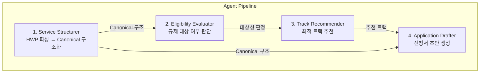
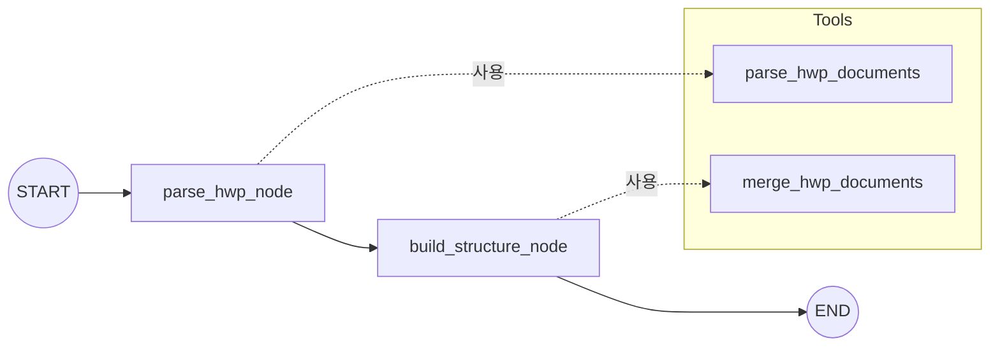
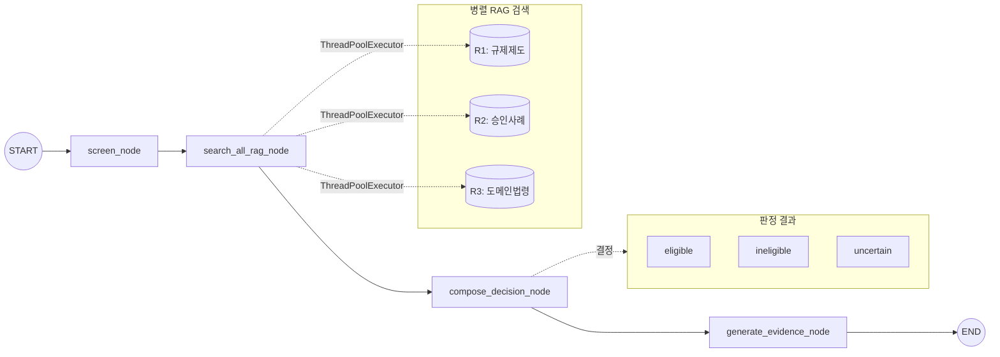
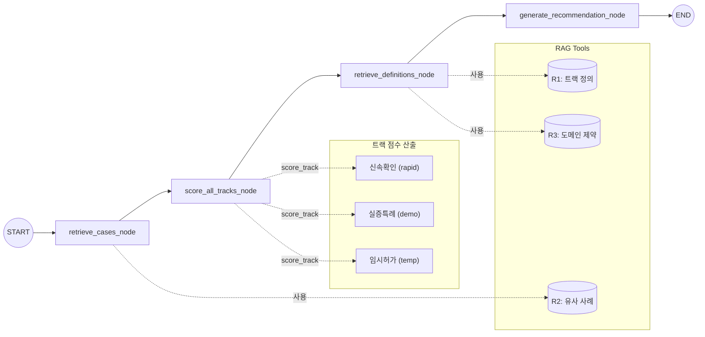
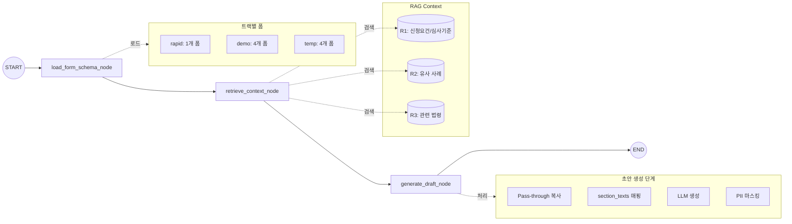
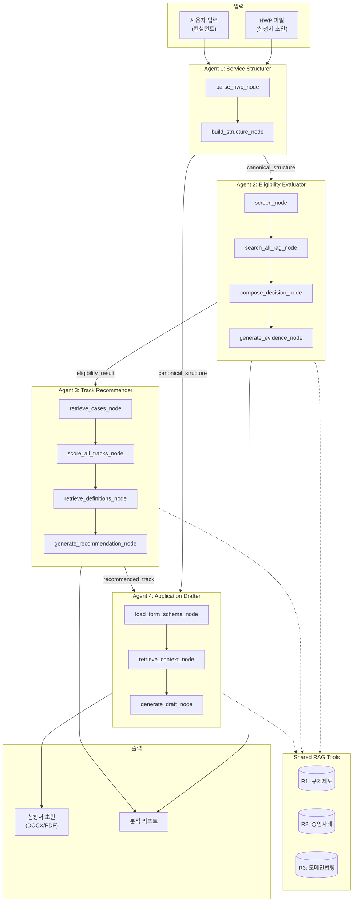
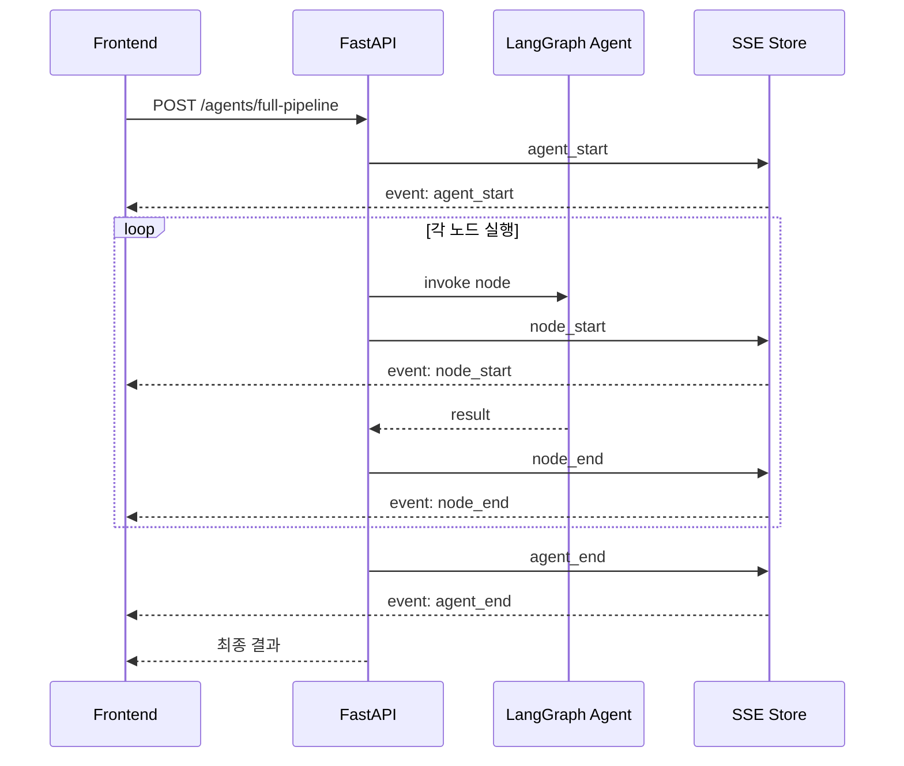

# LangGraph Multi-Agent Architecture

SandboxIA의 AI 멀티에이전트 시스템 상세 분석 문서입니다.

## Overview

SandboxIA는 LangGraph 기반의 멀티에이전트 아키텍처를 사용하여 규제 샌드박스 신청 과정을 자동화합니다. 현재 4개의 에이전트가 구현되어 있으며, 각 에이전트는 StateGraph 패턴을 사용하여 워크플로우를 정의합니다.



## Shared RAG Tools

모든 에이전트가 공용으로 사용하는 3개의 RAG(Retrieval-Augmented Generation) 도구입니다.

| RAG | 데이터 | 주요 활용 |
|-----|-------------|----------|
| R1 규제제도/절차 | 트랙 정의, 절차/요건/심사기준 | 대상성 판단, 트랙 추천, 신청서 작성 |
| R2 승인 사례 | 승인/반려 사례, 조건, 실증 범위 | 유사 사례 검색, 전략 조언 |
| R3 도메인별 법령 | 분야별 법령, 인허가 체계 | 규제 쟁점 분석, 법적 근거 |

### R1: 규제제도 & 절차 RAG (`regulation_rag.py`)

ICT 규제샌드박스 제도 관련 정보를 검색합니다.

| 함수 | 설명 |
|------|------|
| `search_regulation` | 규제제도 일반 검색 |
| `get_track_definition` | 트랙별 정의 조회 (신속확인/실증특례/임시허가) |
| `get_application_requirements` | 트랙별 신청 요건 조회 |
| `get_review_criteria` | 트랙별 심사 기준 조회 |
| `compare_tracks` | 트랙 간 비교 정보 조회 |
| `list_available_tracks` | 사용 가능한 트랙 목록 |

**데이터 스키마 (RegulationResult)**:
```python
content: str              # 내용
document_title: str       # 문서 제목
section_title: str        # 섹션 제목
track: str                # 트랙 (신속확인/실증특례/임시허가)
category: str             # 카테고리 코드
category_label: str       # 카테고리 한글명
ministry: str             # 관련 부처
citation: str             # 인용 형식
source_url: str           # 원본 문서 URL
relevance_score: float    # 관련도 점수
```

### R2: 승인 사례 RAG (`case_rag.py`)

규제 샌드박스 승인/반려 사례를 검색합니다.

| 함수 | 설명 |
|------|------|
| `search_case` | 사례 일반 검색 |
| `get_similar_cases_for_application` | 신청서 작성용 유사 사례 검색 |
| `get_case_detail` | 특정 사례 상세 정보 조회 |
| `get_approval_patterns` | 승인 패턴 추출 |

**데이터 스키마 (CaseResult)**:
```python
case_id: str              # 사례 고유 ID
company_name: str         # 신청 기업명
all_companies: list[str]  # 컨소시엄 전체 기업 목록
service_name: str         # 서비스명
track: str                # 트랙 (실증특례/임시허가)
designation_number: str   # 지정번호
service_description: str  # 서비스 설명
current_regulation: str   # 현행 규제
special_provisions: str   # 특례 내용
conditions: list[str]     # 부가 조건
pilot_scope: str          # 실증 범위
expected_effect: str      # 기대 효과
review_result: str        # 심의 결과
designation_date: str     # 지정(승인) 날짜
relevance_score: float    # 관련도 점수
source_url: str           # 원본 문서 URL
```

### R3: 도메인별 법령 RAG (`domain_law_rag.py`)

분야별 주요 법령 및 인허가 체계를 검색합니다.

| 함수 | 설명 |
|------|------|
| `search_domain_law` | 도메인별 법령 검색 |

**지원 도메인**:
- `healthcare`: 의료, 헬스케어
- `finance`: 금융, 핀테크
- `data`: 데이터
- `privacy`: 개인정보
- `telecom`: 통신, ICT
- `regulation`: 규제, 제도, 샌드박스

**데이터 스키마 (DomainLawResult)**:
```python
content: str              # 조문 내용
law_name: str             # 법령명
article_no: str           # 조문번호
article_title: str        # 조문제목
paragraph_no: str         # 항번호 (①②③ 등)
citation: str             # 인용 형식 (예: 의료법 제34조 제1항)
domain: str               # 도메인 코드
domain_label: str         # 도메인 한글명
source_url: str           # 국가법령정보센터 URL
relevance_score: float    # 관련도 점수
```

---

## Agent 1: Service Structurer (서비스 구조화)

HWP 신청서를 파싱하여 정규화된 Canonical 구조로 변환합니다.

### 역할

- HWP 파일에서 서비스 정보 추출
- 다중 HWP 문서 병합
- 정규화된 Canonical 구조 생성 (다른 에이전트의 입력 데이터)

### 워크플로우



### State 정의

```python
class ServiceStructurerState(TypedDict):
    session_id: str              # 세션 ID
    requested_track: str         # 요청된 트랙
    consultant_input: str        # 컨설턴트 입력
    file_paths: list[str]        # HWP 파일 경로들
    hwp_parse_results: list[dict] # HWP 파싱 결과
    canonical_structure: dict    # 최종 정규화 구조
```

### Node 상세

#### 1. `parse_hwp_node`
- **역할**: HWP 파일을 파싱하여 텍스트 추출
- **도구**: `parse_hwp_documents` tool 호출
- **출력**: `hwp_parse_results` (파싱된 HWP 내용 리스트)

#### 2. `build_structure_node`
- **역할**: 파싱된 HWP 내용을 Canonical 구조로 변환
- **처리**:
  1. 다중 HWP 결과 병합 (`merge_hwp_documents`)
  2. LLM을 통한 구조화
- **출력**: `canonical_structure`

### Tools

| Tool | 설명 |
|------|------|
| `parse_hwp_documents` | HWP 파일 파싱 (pyhwpx 라이브러리 사용) |
| `merge_hwp_documents` | 다중 HWP 문서 병합 |

### 사용 RAG Tools

- R1 (규제제도): 제도 정의 참조
- R3 (도메인 법령): 규제 쟁점 도출

---

## Agent 2: Eligibility Evaluator (대상성 판단)

서비스가 규제 샌드박스 대상인지 판단합니다.

### 역할

- 규제 키워드 스크리닝
- 유사 승인 사례 검색
- 대상성 판정 (eligible/ineligible/uncertain)

### 워크플로우



### State 정의

```python
class EligibilityState(TypedDict):
    project_id: str              # 프로젝트 ID
    canonical: dict              # Canonical 구조 (입력)

    # 스크리닝 결과
    screening_result: dict       # 키워드 스크리닝 결과

    # RAG 검색 결과
    regulation_results: list     # R1 결과
    case_results: list           # R2 결과
    law_results: list            # R3 결과

    # 판정 결과
    eligibility_label: str       # eligible/ineligible/uncertain
    confidence_score: float      # 신뢰도 점수 (0.0~1.0)
    eligibility_reasoning: str   # 판정 근거
    key_evidence: list[str]      # 핵심 증거

    # 출력
    output: dict                 # 최종 출력
```

### Node 상세

#### 1. `screen_node`
- **역할**: 규제 키워드 기반 1차 스크리닝
- **도구**: `rule_screener` tool 호출
- **출력**: `screening_result` (도메인, 키워드 매칭 결과)

#### 2. `search_all_rag_node`
- **역할**: R1, R2, R3 병렬 검색
- **특징**: `ThreadPoolExecutor`로 3개 RAG 동시 검색
- **출력**: `regulation_results`, `case_results`, `law_results`

#### 3. `compose_decision_node`
- **역할**: LLM 기반 최종 판정
- **입력**: 스크리닝 결과 + RAG 결과
- **출력**: `eligibility_label`, `confidence_score`, `eligibility_reasoning`

#### 4. `generate_evidence_node`
- **역할**: 판정 근거 문서화
- **출력**: `key_evidence`, `output`

### Tools

| Tool | 설명 |
|------|------|
| `rule_screener` | 키워드/도메인 기반 규제 스크리닝 |

**REGULATION_KEYWORDS 도메인 매핑**:
```python
REGULATION_KEYWORDS = {
    "의료/헬스케어": ["의료", "진단", "원격의료", ...],
    "금융/핀테크": ["금융", "결제", "대출", ...],
    "개인정보/데이터": ["개인정보", "데이터", ...],
    "통신/ICT": ["통신", "인터넷", ...],
    ...
}
```

### 사용 RAG Tools

- R1 (규제제도): 대상 여부 기준
- R2 (승인 사례): 유사 사례 존재 여부
- R3 (도메인 법령): 관련 법령 확인

---

## Agent 3: Track Recommender (트랙 추천)

최적의 규제 샌드박스 트랙을 추천합니다.

### 역할

- 3개 트랙(신속확인/실증특례/임시허가) 적합도 평가
- 유사 승인 사례 기반 추천
- 트랙별 준비사항 안내

### 워크플로우



### State 정의

```python
class TrackRecommenderState(TypedDict):
    project_id: str              # 프로젝트 ID
    canonical: dict              # Canonical 구조 (입력)

    # 검색 결과
    similar_cases: list[dict]    # 유사 사례
    track_definitions: dict      # 트랙 정의
    domain_constraints: list[dict] # 도메인 제약

    # 평가 결과
    track_scores: dict           # 트랙별 점수 {"demo": 85, "temp": 70, "rapid": 60}
    track_ranks: list            # 순위 정렬된 트랙
    status_evaluation: dict      # 상태 평가

    # 출력
    recommended_track: str       # 추천 트랙
    recommendation_reasoning: str # 추천 근거
    output: dict                 # 최종 출력
```

### Node 상세

#### 1. `retrieve_cases_node`
- **역할**: 유사 승인 사례 검색
- **도구**: `retrieve_similar_cases` tool
- **출력**: `similar_cases`

#### 2. `score_all_tracks_node`
- **역할**: 3개 트랙 적합도 점수 산출
- **도구**: `score_track` tool (3회 호출)
- **출력**: `track_scores`, `track_ranks`

#### 3. `retrieve_definitions_node`
- **역할**: 추천 트랙 정의 및 도메인 제약 조회
- **도구**: `retrieve_track_definitions`, `retrieve_domain_constraints`
- **출력**: `track_definitions`, `domain_constraints`

#### 4. `generate_recommendation_node`
- **역할**: LLM 기반 추천 설명 생성
- **출력**: `recommended_track`, `recommendation_reasoning`, `output`

### Tools

| Tool | 설명 |
|------|------|
| `score_track` | 특정 트랙 적합도 점수 산출 (0-100) |
| `retrieve_track_definitions` | 트랙 정의 조회 |
| `retrieve_similar_cases` | 유사 승인 사례 검색 |
| `retrieve_domain_constraints` | 도메인별 제약사항 조회 |
| `calculate_ranks_and_status` | 순위 계산 및 상태 평가 |

### 사용 RAG Tools

- R1 (규제제도): 트랙 정의/요건
- R2 (승인 사례): 유사 사례 기반 추천
- R3 (도메인 법령): 도메인별 제약

### 트랙 점수 산출 기준

```python
# 점수 범위: 0-100
# 평가 요소:
- 서비스 혁신성
- 규제 충돌 정도
- 기존 사례 유사성
- 실증 가능 범위
- 안전성 검증 수준
```

---

## Agent 4: Application Drafter (신청서 초안)

규제 샌드박스 신청서 초안을 자동 생성합니다.

### 역할

- 트랙별 신청서 양식 로드
- Canonical 데이터 기반 자동 채움 (Pass-through)
- LLM 기반 서술형 필드 생성
- PII(개인식별정보) 마스킹

### 워크플로우



### State 정의

```python
class ApplicationDrafterState(TypedDict):
    project_id: str              # 프로젝트 ID
    canonical: dict              # Canonical 구조 (입력)
    track: str                   # 선택된 트랙

    # 스키마 & 컨텍스트
    form_schema: dict            # 폼 스키마 (트랙별)
    application_requirements: list # 신청 요건 (R1)
    review_criteria: list        # 심사 기준 (R1)
    similar_cases: list          # 유사 사례 (R2)
    domain_laws: list            # 관련 법령 (R3)

    # 출력
    application_draft: dict      # 생성된 신청서 초안
    output: dict                 # 최종 출력
```

### Node 상세

#### 1. `load_form_schema_node`
- **역할**: 트랙에 맞는 폼 스키마 로드
- **트랙별 폼**:
  - `rapid` (신속확인): 1개 폼
  - `demo` (실증특례): 4개 폼
  - `temp` (임시허가): 4개 폼
- **출력**: `form_schema`

#### 2. `retrieve_context_node`
- **역할**: 신청서 작성에 필요한 RAG 컨텍스트 수집
- **검색 내용**:
  - R1: 신청 요건, 심사 기준
  - R2: 유사 승인 사례
  - R3: 도메인별 법령
- **출력**: `application_requirements`, `review_criteria`, `similar_cases`, `domain_laws`

#### 3. `generate_draft_node`
- **역할**: 신청서 초안 생성
- **처리 단계**:
  1. 폼 스키마 복사
  2. Pass-through 데이터 채움 (회사정보, 재무현황)
  3. `section_texts`에서 직접 매핑 (LLM 없이)
  4. 트랙 변환 시 필드 초기화
  5. 빈 서술형 필드만 LLM 생성
- **출력**: `application_draft`

### 필드 처리 전략

| 필드 유형 | 처리 방식 |
|----------|----------|
| **메타데이터** (회사명, 사업자번호 등) | Canonical에서 그대로 복사 (Pass-through) |
| **섹션 원문** (서비스 설명, 규제 내용 등) | `section_texts`에서 직접 매핑 |
| **빈 서술형 필드** | LLM 생성 (RAG 컨텍스트 활용) |
| **숫자/금액 필드** | LLM 생성 금지 (할루시네이션 방지) |

### PII 마스킹 함수

외부 LLM 전송 시 개인정보 보호를 위한 마스킹:

```python
mask_name("김영희")           # → "김**"
mask_business_number("123-45-67890")  # → "***-**-*7890"
mask_phone("010-1234-5678")   # → "***-****-5678"
mask_email("user@example.com") # → "***@example.com"
mask_address("서울특별시 강남구 ...")  # → "서울특별시 [상세주소 생략]"
```

### 사용 RAG Tools

- R1 (규제제도): 섹션 요구사항, 작성 가이드
- R2 (승인 사례): 근거 문장, 표현 참고
- R3 (도메인 법령): 법적 근거

---

## Progress Streaming (실시간 진행 상황)

SSE(Server-Sent Events)를 통한 에이전트 실행 진행 상황 스트리밍입니다.

### 구현 (`utils/streaming.py`)

```python
async def run_agent_with_progress(
    agent: Any,
    initial_state: dict,
    project_id: str,
    agent_type: str,
    config: dict | None = None,
) -> dict:
    """에이전트 실행과 진행 상황 추적"""
```

### 이벤트 타입

| 이벤트 | 설명 |
|--------|------|
| `agent_start` | 에이전트 실행 시작 |
| `node_start` | 노드 실행 시작 |
| `node_end` | 노드 실행 완료 |
| `agent_end` | 에이전트 실행 완료 |
| `error` | 오류 발생 |

### 클라이언트 연동

```typescript
// SSE 연결 예시
const eventSource = new EventSource(`/api/v1/agents/progress/${projectId}`);

eventSource.onmessage = (event) => {
  const data = JSON.parse(event.data);
  // 진행 상황 UI 업데이트
  updateProgress(data.event_type, data.node_name);
};
```

---

## 향후 구현 예정 에이전트

### Agent 5: Strategy Advisor (전략 추천)

유사 승인 사례 기반 전략 조언을 제공합니다.

**계획된 Tools**:
- 사례 클러스터 선택
- 승인 패턴 추출
- 전략 생성
- 인용 스니펫 제공

### Agent 6: Risk Checker (리스크 체크)

QA 체크리스트 및 리스크를 식별합니다.

**계획된 Tools**:
- 체크리스트 생성
- 누락/약점 탐지
- 리스크 시나리오 생성
- 개선 제안
- 최종 검수 리포트

---

## API 엔드포인트

| 엔드포인트 | 에이전트 | 설명 |
|-----------|----------|------|
| `POST /api/v1/agents/structure` | Service Structurer | 서비스 구조화 |
| `POST /api/v1/agents/eligibility` | Eligibility Evaluator | 대상성 판단 |
| `POST /api/v1/agents/track` | Track Recommender | 트랙 추천 |
| `POST /api/v1/agents/draft` | Application Drafter | 신청서 초안 |
| `POST /api/v1/agents/full-pipeline` | 전체 | 파이프라인 실행 |
| `GET /api/v1/agents/progress/{project_id}` | - | SSE 진행 상황 |

---

## 기술적 특징

### 1. StateGraph 패턴

모든 에이전트는 LangGraph의 StateGraph를 사용:

```python
from langgraph.graph import StateGraph, START, END

graph = StateGraph(AgentState)
graph.add_node("node_name", node_function)
graph.add_edge(START, "node_name")
graph.add_edge("node_name", END)

agent = graph.compile()
```

### 2. TypedDict State

타입 안전한 상태 관리:

```python
from typing import TypedDict, Annotated
from operator import add

class AgentState(TypedDict):
    messages: Annotated[list, add]  # 메시지 누적
    data: dict                       # 데이터 저장
```

### 3. Recursion Limit

무한 루프 방지를 위한 재귀 제한:

```python
config = {"recursion_limit": 15}
result = await agent.ainvoke(state, config)
```

### 4. 병렬 RAG 검색

ThreadPoolExecutor를 사용한 병렬 검색:

```python
from concurrent.futures import ThreadPoolExecutor

with ThreadPoolExecutor(max_workers=3) as executor:
    r1_future = executor.submit(search_regulation, ...)
    r2_future = executor.submit(search_case, ...)
    r3_future = executor.submit(search_domain_law, ...)

    r1_results = r1_future.result()
    r2_results = r2_future.result()
    r3_results = r3_future.result()
```

---

## 에이전트 추가 가이드

새로운 에이전트를 추가하려면:

1. **디렉토리 생성**: `app/agents/{agent_name}/`
2. **State 정의**: `state.py`에 TypedDict 정의
3. **Tools 구현**: `tools.py`에 `@tool` 데코레이터 함수
4. **Nodes 구현**: `nodes.py`에 노드 함수
5. **Graph 정의**: `graph.py`에 StateGraph 구성
6. **API 라우트**: `app/api/routes/`에 엔드포인트 추가
7. **공용 RAG**: `app/tools/shared/rag/`의 도구 활용

---

## 전체 에이전트 흐름도

### 에이전트 파이프라인 상세



### 데이터 흐름 상세

```mermaid
flowchart LR
    subgraph Step1["Step 1: 구조화"]
        HWP["HWP Files"] --> PARSE["파싱"]
        PARSE --> CANONICAL["Canonical Structure"]
    end

    subgraph Step2["Step 2: 대상성 판단"]
        CANONICAL --> SCREEN["키워드 스크리닝"]
        SCREEN --> SEARCH["RAG 검색<br/>(R1+R2+R3 병렬)"]
        SEARCH --> DECIDE["판정"]
        DECIDE --> LABEL["eligible<br/>ineligible<br/>uncertain"]
    end

    subgraph Step3["Step 3: 트랙 추천"]
        LABEL --> CASES["유사 사례 검색"]
        CASES --> SCORE["트랙별 점수 산출<br/>rapid / demo / temp"]
        SCORE --> RECOMMEND["추천 생성"]
    end

    subgraph Step4["Step 4: 신청서 작성"]
        RECOMMEND --> SCHEMA["폼 스키마 로드"]
        CANONICAL --> SCHEMA
        SCHEMA --> CONTEXT["RAG 컨텍스트 수집"]
        CONTEXT --> DRAFT["초안 생성"]
        DRAFT --> OUTPUT["DOCX/PDF 출력"]
    end

    style CANONICAL fill:#e1f5fe
    style LABEL fill:#fff3e0
    style RECOMMEND fill:#e8f5e9
    style OUTPUT fill:#fce4ec
```



### SSE 이벤트 흐름



---

## 참고 문서

- [LangGraph Documentation](https://langchain-ai.github.io/langgraph/)
- [LangChain Tools](https://python.langchain.com/docs/modules/tools/)
- [Server CLAUDE.md](../server/CLAUDE.md)
